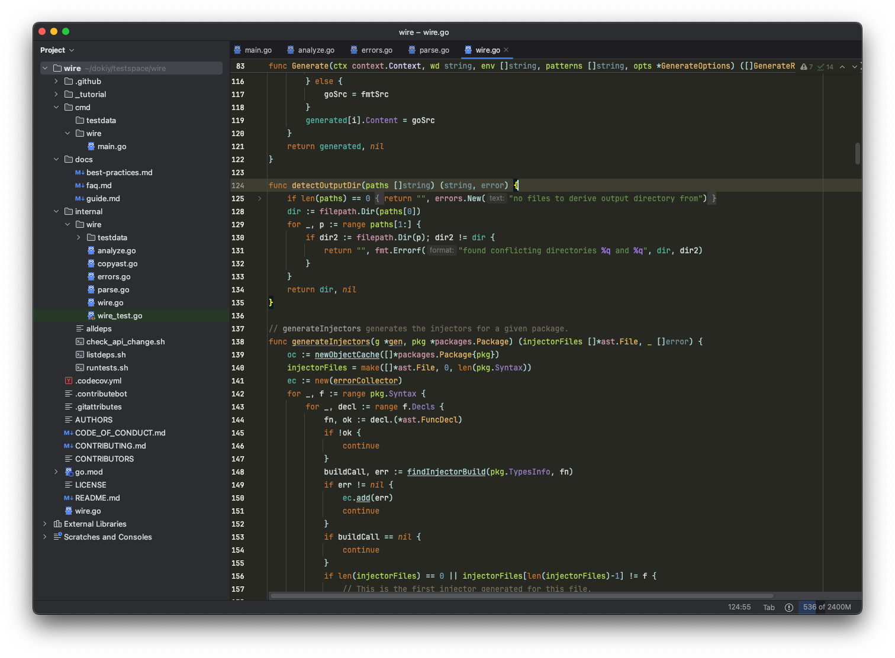

# goland-colorful-theme

To install:
* Go to Settings (Preferences) | Plugins, find the theme plugin and install it
* Restart IDE
* Go to Settings (Preferences) | Appearance & Behavior | Appearance and see the Theme dropdown

